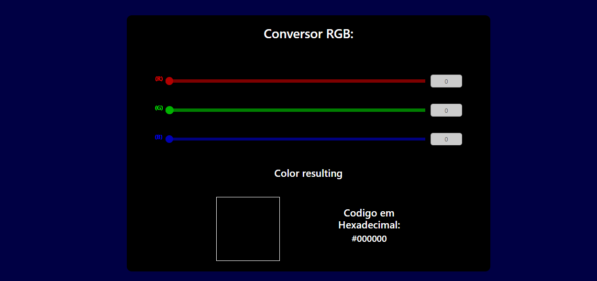

<h1 align="center">Obtain Colors from the RGB code</h1>

## Índice

- [Sobre](#-sobre)
- [Resultado](#-resultado)
- [Tecnologias](#-tecnologias)
- [Fontes](#-fontes)

---

### Sobre

Código desenvolvido como uma das atividades do [BootCampIGTI](https://www.igti.com.br/) de Desenvolvedor FUll Stack. O trabalho consistia em criar um código, usando HTML, CSS e Javascript, onde um valor RGB era setado e aparecia a cor correspondente.

---

### Resultado

O resultado obtido pode ser visto na figura 1:

<figure class="image">
  
  <figcaption align="center">Figura 1: Tela Inicial da Aplicação.</figcaption>
</figure>

A figura 2 mostra um exemplo da aplicação:

<figure class="image">
  
  <figcaption align="center">Figura 2: Exemplo da aplicação.</figcaption>
</figure>

---

### Tecnologias

Foram usadas as seguintes tecnologias:

- HTML
- CSS
- Javascript
- Bootstrap

---

### Fontes

- O código para converter de rgb - hexadecimal foi obtido na seguinte fonte:

  https://campushippo.com/lessons/how-to-convert-rgb-colors-to-hexadecimal-with-javascript-78219fdb
